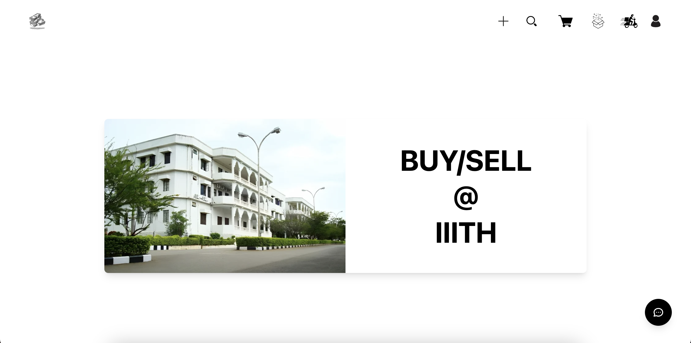

# E-Commerce Website

## File Structure
```
.
├── ./README.md
├── ./backend
│   ├── ./backend/config
│   │   └── ./backend/config/mongodb.js
│   ├── ./backend/controllers
│   │   ├── ./backend/controllers/cartController.js
│   │   ├── ./backend/controllers/chatController.js
│   │   ├── ./backend/controllers/orderController.js
│   │   ├── ./backend/controllers/productController.js
│   │   ├── ./backend/controllers/reviewController.js
│   │   ├── ./backend/controllers/sellerController.js
│   │   └── ./backend/controllers/userController.js
│   ├── ./backend/middleware
│   │   └── ./backend/middleware/authMiddleware.js
│   ├── ./backend/models
│   │   ├── ./backend/models/itemModel.js
│   │   ├── ./backend/models/orderModel.js
│   │   ├── ./backend/models/reviewModel.js
│   │   └── ./backend/models/userModels.js
│   ├── ./backend/package-lock.json
│   ├── ./backend/package.json
│   ├── ./backend/routes
│   │   ├── ./backend/routes/cartRoute.js
│   │   ├── ./backend/routes/chatRoute.js
│   │   ├── ./backend/routes/orderRoute.js
│   │   ├── ./backend/routes/productRoute.js
│   │   ├── ./backend/routes/reviewRoute.js
│   │   ├── ./backend/routes/sellerRoute.js
│   │   └── ./backend/routes/userRoute.js
│   └── ./backend/server.js
├── ./filestructure.txt
└── ./frontend
    ├── ./frontend/README.md
    ├── ./frontend/eslint.config.js
    ├── ./frontend/index.html
    ├── ./frontend/package-lock.json
    ├── ./frontend/package.json
    ├── ./frontend/postcss.config.js
    ├── ./frontend/public
    │   └── ./frontend/public/vite.svg
    ├── ./frontend/src
    │   ├── ./frontend/src/App.jsx
    │   ├── ./frontend/src/assets
    │   │   ├── ./frontend/src/assets/assets.js
    │   │   ├── ./frontend/src/assets/cart.png
    │   │   ├── ./frontend/src/assets/deliver.png
    │   │   ├── ./frontend/src/assets/iiith.png
    │   │   ├── ./frontend/src/assets/logo.png
    │   │   ├── ./frontend/src/assets/order.png
    │   │   ├── ./frontend/src/assets/plus.png
    │   │   ├── ./frontend/src/assets/profile.png
    │   │   └── ./frontend/src/assets/search.png
    │   │   └── ./frontend/src/assets/Website.png
    │   ├── ./frontend/src/components
    │   │   └── ./frontend/src/components/Navbar.jsx
    │   ├── ./frontend/src/context
    │   ├── ./frontend/src/index.css
    │   ├── ./frontend/src/index.jsx
    │   ├── ./frontend/src/main.jsx
    │   └── ./frontend/src/pages
    │       ├── ./frontend/src/pages/BoughtItems.jsx
    │       ├── ./frontend/src/pages/Cart.jsx
    │       ├── ./frontend/src/pages/Deliver.jsx
    │       ├── ./frontend/src/pages/Home.jsx
    │       ├── ./frontend/src/pages/Item.jsx
    │       ├── ./frontend/src/pages/Login.jsx
    │       ├── ./frontend/src/pages/Orders.jsx
    │       ├── ./frontend/src/pages/Product.jsx
    │       ├── ./frontend/src/pages/Profile.jsx
    │       ├── ./frontend/src/pages/Register.jsx
    │       ├── ./frontend/src/pages/Sell.jsx
    │       ├── ./frontend/src/pages/SellItem.jsx
    │       └── ./frontend/src/pages/SoldItems.jsx
    ├── ./frontend/tailwind.config.js
    └── ./frontend/vite.config.js
```

## Assumptions

- Each item has a quantity of 1. Items are sold as units and cannot be sold in bulk (e.g., cannot list 5 biscuits and allow a buyer to buy 3).
- Only users with an IIIT domain email can register.
- OTP is flashed upon regeneration and only its hash is stored.
- Both pending and completed orders are visible to the user.
- Reviews can only be made after an order is completed.
- Items that are placed for order are updated to status "sold" and do not appear in the view of other buyers or the seller.
- The seller can only delete an item if it has not been placed for order.
- The chatbot feature is only available at home component.

## Page Descriptions

- **Home Page**: Users can chat with the assistant to get help with buying and selling items. The left icon on the navbar directs to the home page. They can also chat with the AI-bot assisstant that helps the users with navigation and questions pertaining to the website.
- **Sell Page**: Users can list new items for sale by clicking on the add new item button and providing the name, price, description, and category of the item. The plus sign icon on the navbar directs to the sell page.
- **Shop Page**: Users can browse and buy items listed for sale. The shopping cart icon on the navbar directs to the shop page.
- **Order History Page**: Users can view their order history, track pending and completed orders, and see reviews given by buyers. The box logo on the navbar directs to the order history page. They can also check their previosuly bought and sold items.
- **Cart Page**: Users can view their cart and proceed to checkout. The cart icon on the navbar directs to the cart page.
- **Deliver Items Page**: Users can complete order deliveries by generating an OTP in the order history page and providing it to the seller. Sellers can enter the OTP to complete the order delivery and regenerate it if needed. The delivery scooter icon on the navbar directs to the deliver items page.
- **Profile Page**: Users can view and edit their profile. The profile icon on the navbar directs to the profile page.
- **Item Details Page**: Users can view item details by clicking on the item name in the shop page. They can add items to their cart by clicking on the add to cart button in the item details page.

## Wesite view
